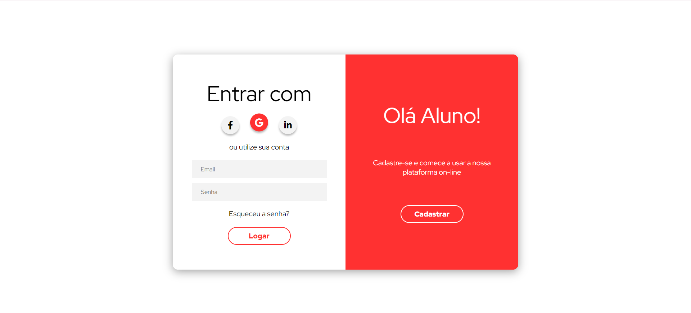

# Login - Youtube

|      MOBILE         |          DESKTOP       |
|:-------------------:|:-----------------------:
|||
|                     |                        |

[Clique aqui](https://guilima005.github.io/login-youtube/) para acessar o site!
---
## Sobre 

- Site de login. O objetivo deste projeto é colocar em pratica os conhecimentos adquiridos no [vídeo](https://youtu.be/-lfa4noP46U) do [Professor Leonid](https://github.com/fernandoleonid) na criação de web sites.

## Tecnologias utilizadas 
- HTML
- CSS
- Java Script
- Markdown
- Framework
- Responsividade

## Ferramentas
- [Figma](https://www.figma.com/file/2v1kiXUASdj7r84GnbJAFT/login-youtube?node-id=0%3A1&t=itDv4IcmXmTd5BuM-0)
- [Youtube](https://youtu.be/-lfa4noP46U)
- Font Awesome
- Visual Studio Code

## Autor
- [Guilherme Lima](https://github.com/GuiLima005)
